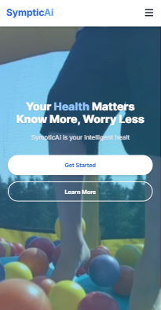
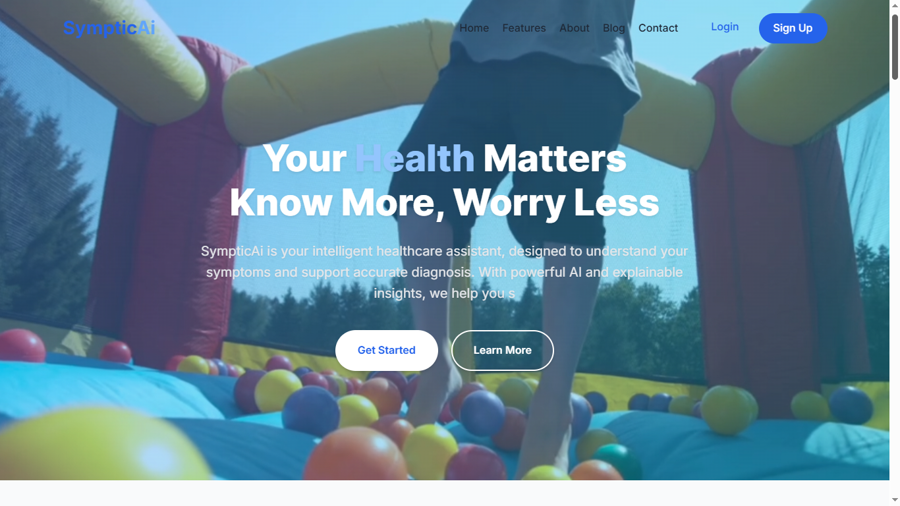
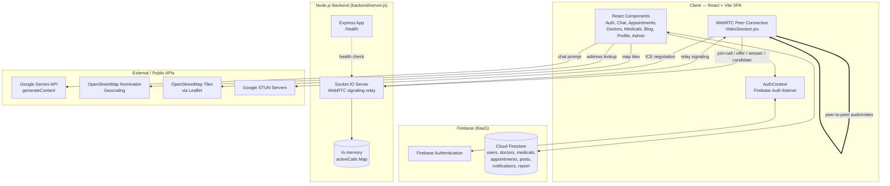
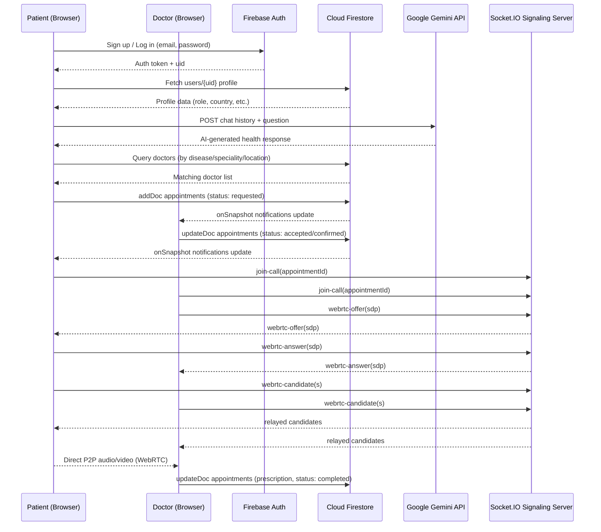

# 🩺 Symptic - HealthApp

**Symptic** is a full-stack telehealth platform that connects patients with doctors through an AI-assisted symptom checker, appointment booking, live video consultations, a health community blog, and an admin control center. It is built as a two-part system: a **React (Vite) single-page application** for the client, and a lightweight **Node.js / Express / Socket.IO** signaling server that powers real-time WebRTC video calls.

<table align="center" border="0" cellpadding="10">
  <tr>
    <td></td>
    <td></td>
  </tr>
</table>

## Project Overview

Symptic is a patient–doctor healthcare web application. Patients can sign up, chat with an AI health assistant, search for doctors and nearby medical facilities, book appointments, join live video consultations with their doctor, and read/write posts in a community health blog. Doctors sign up through the same portal but are placed in a **pending** state until an admin reviews and approves their credentials, after which a doctor profile is generated for them. A dedicated **Admin Panel** gives administrators full control over user approvals, doctor management, medical facility listings, blog moderation, and user-submitted reports.

The project is organized as two independent Node.js applications inside a single repository:

- **`client/`** – the React frontend (Vite-powered SPA), which talks directly to **Firebase** (Authentication + Firestore) for all data and identity operations, and to the **Google Gemini API** for AI chat responses.
- **`backend/`** – a minimal **Express + Socket.IO** server whose only responsibility is WebRTC signaling (offer/answer/ICE candidate relay) for the video consultation feature and a `/health` status endpoint.
- **Deployment** – The frontend (client) is deployed on Vercel, while the backend (backend) is deployed on Render. This separation allows the frontend to be served as a static application while the backend provides persistent WebSocket connections required for WebRTC signaling. Link: <https://client-six-omega-85.vercel.app/>

## Project Objective

The goal of Symptic is to make basic healthcare guidance and doctor access more reachable by combining:
1. An **AI-powered symptom/health assistant** for instant, general (non-diagnostic) health information.
2. A **doctor discovery and booking system** so users can find specialists by disease, location, hospital, or speciality.
3. **Real-time video consultations** using WebRTC so patients and doctors can complete an appointment without any third-party video tool.
4. A **community blog** where verified users can share health posts, comment, and give feedback.
5. An **admin layer** that keeps the platform trustworthy by manually vetting every doctor account before it goes live.

---

## Features

Using **React function components + Hooks**, **React Router v7**, **Firebase Authentication & Firestore**, **Socket.IO**, native **WebRTC**, and the **Google Gemini `generateContent` REST API**, Symptic implements the following:

### 🔐 Authentication & Roles
- Email/password **Signup** (`Signup.jsx`) and **Login** (`Login.jsx`) using Firebase Auth (`createUserWithEmailAndPassword`, `signInWithEmailAndPassword`).
- Role selection at signup: **patient** or **doctor**. Doctor accounts are created with `status: "pending"`; patient accounts are `status: "approved"` immediately.
- Doctor applicants can attach a **LinkedIn URL**, **CV link**, and **medical registration number** during signup, which the admin reviews.
- Password strength enforced client-side via regex (min 6 chars, upper+lowercase+number).
- **`AuthContext`** (React Context) subscribes to `onAuthStateChanged` and merges Firebase Auth data with the user's Firestore `users/{uid}` document, exposing `currentUser`, `loading`, `error`, and `logout()` to the whole app.
- **`ProtectedRoute`** component redirects unauthenticated users to `/login`, and can additionally gate specific routes by `roles`.
- **`useLogout`** hook centralizes sign-out and redirect logic, with an optional cleanup callback (used to tear down active video sessions before logging out).
- Admins are routed straight to `/test` (Admin Panel) on login; blocked users (`blocked: true` in Firestore) are stopped from entering the app with an alert.

### 🤖 AI Health Assistant (SympticAI Chat) [[See another Updated version](https://github.com/MustafizEmon/HealthChatbot.git)]
- A full chat UI (`HealthAIChat.jsx`) that maintains conversation history in React state and forwards it to the **Gemini `generateContent` endpoint** using the Gemini `contents`/`role`/`parts` schema.
- A hidden system-style seed message (`companyInfo.js`) is injected as the first turn to steer the assistant's persona ("a compassionate SympticAI assistant"), tone, and scope (symptom guidance, medication info, condition library, wellness tips, first-aid guidance) before any real user message is sent.
- Every reply is prefixed with an instruction telling the model to act as *"a friendly and professional doctor"* and respond briefly and reassuringly.
- **Command-style intents** are intercepted before hitting the AI:
  - Typing something containing **"medical"** triggers `fetchNearbyMedicalFacilities()`, which reads the signed-in user's `country` from their Firestore profile and queries the `medicals` collection for matches, rendering results as chat bubbles with an inline **"View on Map"** button.
  - Typing **`suggest doctor for <condition>`** triggers `fetchDoctorsForDisease()`, which scans the `doctors` collection for a case-insensitive match against each doctor's `diseases` array and renders result cards with a **"View Details"** button.
- Clicking **"View on Map"** geocodes the facility's address via the public **OpenStreetMap Nominatim API** and opens an in-app **Leaflet** map modal (with a link to open the same location in Google Maps, and a shortcut into the facility's detail page).
- Clicking **"View Details"** on a doctor opens a rich modal (photo, speciality, hospital, rating, experience, education, languages, consultation fee, weekly working hours, treated conditions) with **Book Appointment** and **View Profile** actions.
- Sidebar quick-topics ("Nearby Medicals", "suggest Doctor for Migraine", "suggest Doctor for Heart Disease") auto-fill the input box.
- A live **notification bell** (Firestore `onSnapshot` real-time listener on the `notifications` collection, filtered by `recipientId`) shows unread counts and lets the user mark individual or all notifications as read — present on every authenticated page (Home, Chat, Appointments, Doctors, Medicals, Blog, Profile).
- Persistent medical disclaimer footer: *"SympticAI provides general health information only. It's not a substitute for professional medical advice."*

### 👨‍⚕️ Doctor Discovery
- `DoctorInformation.jsx` lists all doctors from Firestore's `doctors` collection with **live search** (name/speciality) and **filters** for location, treated disease, speciality, and hospital, all derived dynamically from the loaded dataset via `useMemo`.
- Each doctor card links into a details modal and onward to appointment booking.

### 🏥 Medical Facility Directory
- `MedicalList.jsx` lists all entries from the `medicals` collection with search (name/type) and a location filter.
- `MedicalInformation.jsx` shows a single facility's full profile (rating, doctors on staff, description) and lets a user drill into an affiliated doctor's own detail modal.

### 📅 Appointment Booking & Management
- `AppointmentBooking.jsx`: a patient selects a date, fetches that doctor's **available time slots**, fills in patient info/reason for visit, and submits a new document to the `appointments` collection with `status: "requested"` and `paymentStatus: "pending"`.
- `AppointmentManagement.jsx`: a unified dashboard (used by both patients and doctors) that lists appointments and drives them through a status lifecycle: **requested → accepted → confirmed → completed / cancelled**, with role-appropriate action buttons at each stage (accept, confirm, cancel, join call).
- A **"Join Call"** button is only enabled when the appointment is `confirmed` **and** the current time falls inside the appointment's call window (`isWithinCallWindow`, computed with `date-fns` `isWithinInterval`/`subMinutes`/`addMinutes`).
- Booking, acceptance, and status changes automatically write documents into the `notifications` collection so the counterpart (doctor or patient) is notified in real time.

### 📹 Live Video Consultation (WebRTC)
- `VideoSession.jsx` implements a full peer-to-peer video call experience:
  - Requests camera/microphone permission and media (720p ideal, echo cancellation + noise suppression).
  - Connects to the backend's **Socket.IO** signaling server (auto-retry with backoff, connection-state UI: connecting/connected/disconnected/error).
  - Creates an `RTCPeerConnection` with public **Google STUN servers**, exchanges SDP offer/answer and ICE candidates through Socket.IO events (`webrtc-offer`, `webrtc-answer`, `webrtc-candidate`), and restarts ICE automatically on failure.
  - The **doctor** side always initiates the offer (`currentUser.role === 'doctor'` triggers `createOffer()`).
  - In-call controls: mute/unmute microphone, enable/disable camera, end call.
  - A **prescription modal**, allowing the doctor to write and save prescription text tied to the appointment (persisted back to Firestore via `updateDoc`).
  - Auto-hiding on-screen controls and a mobile-friendly control layout.
  - Graceful teardown on `end-call`/disconnect events, releasing all local media tracks and closing the peer connection.

### 📝 Community Blog
- `Blog_page.jsx` supports:
  - Creating, editing, and reading posts (Firestore `posts` collection, ordered by `createdAt`, filtered to `blocked === false`).
  - **Useful / Not Useful** feedback buttons per post (mutually exclusive, stored as `arrayUnion`/`arrayRemove` of user IDs), applied atomically with Firestore `writeBatch`.
  - **Threaded comments and replies**, including deleting a comment and expanding/collapsing long posts.
  - Every meaningful interaction (comment, reply, feedback) generates a **notification** document for the relevant author (unless the author is acting on their own content).

### 🙍 Profile
- `Profile.jsx` renders a role-aware profile page:
  - **Doctors** can edit clinical details (bio, speciality, hospital, education, languages, consultation fee) and manage a **weekly working-hours schedule** (add/edit/remove days and time ranges) via dedicated edit modals.
  - **Patients** see a **live-updating vitals dashboard** (blood pressure, calories, heart rate) rendered with **Recharts**, refreshed every 3 seconds — a simulated "fitband" style widget for demonstration purposes (data is generated client-side, not read from a real wearable).
  - Inline field-by-field editing via a reusable modal (`editModalOpen`, `currentField`, `currentValue`) that writes straight back to the user's Firestore document.

### 🛡️ Admin Panel
- `AdminPanel.jsx` (single large control-center component) provides:
  - **Pending doctor approvals** — approve/reject queue (`users` where `status === "pending"`). Approving a user auto-generates a companion `doctors/{autoId}` document with empty clinical fields, linked back to the user via `userId`.
  - **Approved user management** — list/search all approved users; **block/unblock** any user.
  - **Blog moderation** — list all posts, **block/unblock** individual posts.
  - **Medical facility management** — add new medical facilities, edit existing ones, and delete facilities (`medicals` collection).
  - **Report inbox** — reads all documents from the `report` collection (submitted via the Home page contact form), ordered by newest first, and resolves the submitting user's identity for context.
  - Dashboard statistics summarizing pending/approved counts across the platform.

### 🏠 Landing & Home
- `LandingPage.jsx`: public marketing page with hero video background, typewriter tagline animation (`react-type-animation`), feature highlights, testimonials, and a footer contact form.
- `Home_page.jsx`: the authenticated dashboard/hub with navigation into every module, plus a **"Contact / Report an Issue"** form that writes into the `report` collection for the Admin Panel to triage.

### 🔔 Real-Time Notifications (cross-cutting)
- A shared notification pattern (present on Home, Chat, Appointments, Doctors, Medicals, Profile, and Blog pages) uses a Firestore `onSnapshot` query (`recipientId == currentUser.uid`, ordered by `createdAt desc`, limited to 20) to show a live badge count and dropdown, with per-item and "mark all as read" actions.

---

## System Architecture

Symptic follows a **client-heavy, BaaS-backed architecture**:

- The **React client** is the primary application logic layer. It talks **directly** to **Firebase** (Authentication for identity, Cloud Firestore for all application data — users, doctors, medicals, appointments, posts, notifications, reports) using the Firebase Web SDK. There is **no custom REST API/database server** for CRUD operations; Firestore's client SDK and its security rules serve that role.
- The **Node.js backend** (`backend/server.js`) is a **narrowly scoped real-time signaling relay**. It does not touch Firestore or hold any application state beyond an in-memory `Map` of currently active calls (`socket.id → {appointmentId, userId}`). Its only jobs are:
  1. Let two participants join a Socket.IO "room" named after the `appointmentId`.
  2. Relay WebRTC signaling messages (`webrtc-offer`, `webrtc-answer`, `webrtc-candidate`) between the two participants in that room.
  3. Broadcast connect/disconnect/call-ended events to the room.
  4. Expose a `/health` endpoint reporting live connection/call counts.
- Once signaling completes, video/audio media flows **peer-to-peer** directly between the patient's and doctor's browsers via WebRTC (using public Google STUN servers for NAT traversal) — the backend server never sees or relays the actual audio/video stream.
- The **AI assistant** talks directly from the browser to Google's **Gemini `generateContent` REST endpoint** — there is no backend proxy for AI calls; the Gemini API key is embedded in the client environment variables.
- **Third-party/public services** used directly by the client: **Firebase** (Auth + Firestore), **Google Gemini API** (AI chat), **OpenStreetMap Nominatim** (address → coordinates geocoding), and **Leaflet/OpenStreetMap tiles** (map rendering).

---

## Architecture Diagram



---

## Tech Stack

| Layer | Technology |
|---|---|
| Frontend Framework | React 19 (function components + Hooks) |
| Build Tool / Dev Server | Vite 6 (`@vitejs/plugin-react`) |
| Routing | React Router DOM v7 (`BrowserRouter`, nested/protected routes) |
| Backend Runtime | Node.js |
| Backend Framework | Express 5 |
| Real-Time Signaling | Socket.IO 4 (server: `socket.io`, client: `socket.io-client`) |
| Peer-to-Peer Media | Native WebRTC (`RTCPeerConnection`, browser Media Devices API) |
| Auth & Database | Firebase (Authentication + Cloud Firestore) via `firebase` JS SDK, plus `react-firebase-hooks` |
| AI Model | Google Gemini API (`generateContent` REST endpoint) |
| Mapping | Leaflet + `react-leaflet`, OpenStreetMap tiles, OpenStreetMap Nominatim (geocoding) |
| Charts | Recharts (patient vitals dashboard) |
| Animation | Framer Motion, `react-type-animation` |
| Styling | Inline JS style objects, component-scoped `<style jsx>` blocks, Tailwind CSS + PostCSS/Autoprefixer (build tooling present), plain CSS (`App.css`, `index.css`) |
| Icons | React Icons (`react-icons`), FontAwesome (`@fortawesome/*`) |
| Date/Time | `date-fns`, `moment` |
| Utilities | `uuid`, `lodash`-style array dedupe via native `Set`, `axios` (available for HTTP calls) |
| Modals | `react-modal` |
| Responsive Helpers | `react-responsive` (media-query hooks) |
| Linting | ESLint 9 (`@eslint/js`, `eslint-plugin-react-hooks`, `eslint-plugin-react-refresh`) |
| Package Manager | npm |

## Frameworks & Key Libraries (Detail)

- **React 19 + Vite 6** — the client is a pure SPA scaffolded and served by Vite, using `react()` (Babel-based Fast Refresh) as configured in `vite.config.js`. `socket.io-client` is explicitly pre-bundled via `optimizeDeps.include` to avoid Vite dependency-optimization issues at dev time.
- **React Router DOM v7** — declarative routing for every screen (landing, auth, dashboard, doctors, medicals, blog, appointments, video session, profile, admin), including a custom `ProtectedRoute` wrapper for auth-gated and role-gated routes.
- **Firebase Web SDK** — `firebase/app`, `firebase/auth`, `firebase/firestore`, and `firebase/storage` are all initialized in `src/firebase.js`. Authentication uses email/password sign-in; Firestore is the sole application database, queried directly from React components with `collection`, `query`, `where`, `orderBy`, `limit`, `getDocs`, `getDoc`, `onSnapshot`, `addDoc`, `setDoc`, `updateDoc`, and `writeBatch`. `react-firebase-hooks`'s `useAuthState` is used alongside the custom `AuthContext` in the AI chat screen.
- **Express 5 + Socket.IO 4** — the entire backend is a single `server.js` file. Express only serves a JSON `/health` endpoint; Socket.IO handles all real-time communication, configured with `connectionStateRecovery` (2-minute reconnection grace window) and a strict CORS allow-list built from `CLIENT_URL`.
- **WebRTC** — implemented natively (no wrapper library like PeerJS/simple-peer). ICE candidates are gathered against Google's public STUN servers; SDP offer/answer and ICE candidates are relayed peer-to-peer through the Socket.IO channel scoped to the `appointmentId` room.
- **Leaflet / react-leaflet** — renders an interactive OpenStreetMap-tiled map inside a modal to show a medical facility's geocoded location, with a marker and popup.
- **Recharts** — drives the live `LineChart` of simulated vitals (BP, heart rate, calories) on a patient's profile page.
- **Framer Motion** — powers entrance/exit animations for dropdowns like the notification panel.
- **date-fns + moment** — used together: `date-fns` for relative time formatting (`formatDistanceToNow`) and appointment call-window math (`isWithinInterval`, `subMinutes`, `addMinutes`, `parseISO`); `moment` for date selection/formatting in the booking flow.
- **Tailwind CSS** — configured as a dev dependency (with PostCSS/Autoprefixer) for utility-class styling in select places, alongside the project's dominant inline-style/`<style jsx>` approach.

---

## Complete Folder Explanation

```
symptic/
├── .gitattributes                 # Git line-ending normalization
├── backend/                       # Real-time signaling server
│   ├── .env                       # Backend environment variables (PORT, CLIENT_URL)
│   ├── package.json               # Backend dependencies & start script
│   ├── package-lock.json
│   └── server.js                  # Express app + Socket.IO WebRTC signaling server
│
└── client/                        # React (Vite) frontend application
    ├── .env                       # Frontend environment variables (Firebase, Gemini, Socket server URLs)
    ├── .gitignore
    ├── .gitattributes
    ├── client_secret.json         # Google OAuth client credentials (installed/web app)
    ├── cors.json                  # CORS configuration for Firebase Cloud Storage bucket
    ├── eslint.config.js           # ESLint flat config for the React project
    ├── index.html                 # Vite HTML entry point (mounts #root, loads Inter font)
    ├── package.json               # Frontend dependencies & scripts (dev/build/lint/preview)
    ├── package-lock.json
    ├── vite.config.js             # Vite configuration (React plugin, socket.io-client pre-bundling)
    ├── README.md                  # Default Vite/React template README
    ├── public/
    │   ├── img/                   # Illustrations, screenshots, and marketing images used across pages
    │   ├── videos/landing.mp4     # Hero background video for the Landing Page
    │   └── vite.svg
    └── src/
        ├── App.jsx                # Root component: wraps the app in AuthProvider + BrowserRouter + Routes
        ├── App.css                # Global app-level styles
        ├── index.css              # Global base styles
        ├── main.jsx                # Vite/React entry point (createRoot, StrictMode)
        ├── firebase.js             # Firebase app initialization (Auth, Firestore, Storage)
        ├── assets/
        │   └── react.svg
        ├── api/
        │   └── auth.jsx            # Reserved module for auth API helpers (currently empty)
        ├── contexts/
        │   ├── AuthContext.jsx     # Global auth state provider (currentUser, loading, error, logout)
        │   └── logout.jsx          # useLogout hook: handles cleanup + sign-out + redirect
        └── components/
            ├── Landing_page/
            │   └── LandingPage.jsx        # Public marketing page (hero, features, testimonials, contact)
            ├── auth/
            │   ├── Signup.jsx              # Patient/Doctor registration form
            │   └── Login.jsx               # Login form, role-based post-login redirect
            ├── common/
            │   └── ProtectedRoute.jsx      # Auth/role route guard
            ├── Home_page/
            │   └── Home_page.jsx           # Authenticated dashboard hub + contact/report form
            ├── HealthAIChat/
            │   ├── HealthAIChat.jsx        # AI chat UI, doctor/medical lookups, map & doctor modals
            │   └── companyInfo.js          # System-style prompt describing the AI assistant's persona/scope
            ├── DoctorInformation/
            │   └── DoctorInformation.jsx   # Searchable/filterable doctor directory
            ├── MedicalList/
            │   ├── MedicalList.jsx         # Searchable/filterable medical facility directory
            │   └── MedicalInformation.jsx  # Single facility detail page (staff doctors, map link)
            ├── Appointment/
            │   ├── AppointmentBooking.jsx      # Date/slot selection + appointment creation
            │   └── AppointmentManagement.jsx   # Appointment lifecycle dashboard (both roles)
            ├── VideoSession/
            │   └── VideoSession.jsx        # WebRTC video call screen + prescription modal
            ├── Blog_page/
            │   └── Blog_page.jsx           # Community posts, comments/replies, useful/not-useful feedback
            ├── Profile/
            │   └── Profile.jsx             # Role-aware profile (doctor schedule editor / patient vitals)
            └── admin/
                ├── AdminPanel.jsx          # Admin dashboard: approvals, users, blogs, medicals, reports
                └── test.txt                # Scratch/notes file
```

---

## Installation & Dependencies

### Prerequisites
- **Node.js** and **npm** installed
- A **Firebase project** with **Authentication (Email/Password)** and **Cloud Firestore** enabled
- A **Google Gemini API key** (for the AI chat feature)

### 1. Clone and install the backend

```bash
cd backend
npm install
```

Backend dependencies (`backend/package.json`): `express`, `socket.io`, `cors`, `dotenv`, `http`.

### 2. Install the frontend

```bash
cd client
npm install
```

Frontend dependencies (`client/package.json`) include: `react`, `react-dom`, `react-router-dom`, `firebase`, `react-firebase-hooks`, `socket.io-client`, `axios`, `framer-motion`, `leaflet`, `react-leaflet`, `recharts`, `react-modal`, `react-icons`, `@fortawesome/*`, `styled-components`, `date-fns`, `moment`, `uuid`, `react-responsive`, `react-type-animation`.
Dev dependencies include: `vite`, `@vitejs/plugin-react`, `@vitejs/plugin-react-swc`, `eslint` + plugins, `tailwindcss`, `postcss`, `autoprefixer`.

---

## Configuration

### Firebase Setup
1. Create a Firebase project and enable **Authentication → Sign-in method → Email/Password**.
2. Create a **Cloud Firestore** database and configure security rules to protect the collections listed in [Firestore Data Model](#firestore-data-model).
3. Copy your Firebase Web app config values into `client/.env` (see below).
4. `cors.json` in `client/` defines CORS rules (`GET, PUT, POST, DELETE, OPTIONS`) for the Firebase Storage bucket, intended to be applied with `gsutil cors set cors.json gs://<your-bucket>`, for local origins `http://localhost:5173` and `http://127.0.0.1:5173`.
5. `client_secret.json` contains Google OAuth **web client** credentials (`client_id`, `project_id`, `auth_uri`, `token_uri`, `redirect_uris`, `javascript_origins`) associated with the Firebase/Google Cloud project — keep this file private and out of version control.

### Backend CORS / Client URL
`backend/server.js` restricts Socket.IO and Express CORS to `process.env.CLIENT_URL` (falling back to `http://localhost:3000`), plus HTTPS/HTTP variants of `localhost`/`127.0.0.1`. Set `CLIENT_URL` to your deployed frontend origin in production.

---

## Environment Variables

> ⚠️ Never commit real API keys or secrets. The tables below list variable **names and purpose only** — use your own values.

### `backend/.env`

| Variable | Purpose |
|---|---|
| `PORT` | Port the Express/Socket.IO server listens on (defaults to `3001` in code if unset) |
| `CLIENT_URL` | Allowed frontend origin for CORS (Express & Socket.IO) |

### `client/.env`

| Variable | Purpose |
|---|---|
| `VITE_FIREBASE_KEY` | Firebase Web API key (`apiKey`) |
| `VITE_AUTH_DOMAIN` | Firebase Auth domain |
| `VITE_PROJECT_ID` | Firebase project ID |
| `VITE_STORAGE_BUCKET` | Firebase Cloud Storage bucket name |
| `REACT_APP_SOCKET_SERVER_URL` | (Legacy-named) Socket.IO server URL — present for reference |
| `VITE_API_URL_1` | Google Gemini `generateContent` endpoint URL, including the `key=` query parameter with your Gemini API key |
| `VITE_API_URL` | Base URL of the deployed backend Socket.IO signaling server (used by `VideoSession.jsx`), falls back to a hard-coded Render.com URL if unset |

Example `client/.env` template:

```env
VITE_FIREBASE_KEY="your-firebase-api-key"
VITE_AUTH_DOMAIN="your-project.firebaseapp.com"
VITE_PROJECT_ID="your-project-id"
VITE_STORAGE_BUCKET="your-project.firebasestorage.app"

REACT_APP_SOCKET_SERVER_URL=http://localhost:3001

VITE_API_URL_1=https://generativelanguage.googleapis.com/v1beta/models/gemini-1.5-flash:generateContent?key=YOUR_GEMINI_API_KEY
VITE_API_URL=http://localhost:3001
```

Example `backend/.env` template:

```env
PORT=3001
CLIENT_URL=http://localhost:5173
```

---

## LLM / AI API Setup

Symptic's AI assistant calls **Google's Gemini API** (`gemini-1.5-flash` model family, based on the request/response shape used in code) directly from the browser via `fetch`, with **no backend proxy**.

1. Get a Gemini API key from **Google AI Studio**.
2. Build the `generateContent` REST URL:
   `https://generativelanguage.googleapis.com/v1beta/models/gemini-1.5-flash:generateContent?key=YOUR_API_KEY`
3. Put that full URL (with your key) into `VITE_API_URL_1` in `client/.env`.
4. The client sends a POST request shaped like Gemini's native schema:

```json
{
  "contents": [
    { "role": "user",  "parts": [{ "text": "…seeded persona / prior turns…" }] },
    { "role": "model", "parts": [{ "text": "…assistant's previous reply…" }] },
    { "role": "user",  "parts": [{ "text": "You are a friendly and professional doctor. Answer briefly, politely, and in a tone that reassures the patient. Respond to this query:\n\n\"<user message>\"" }] }
  ]
}
```

5. The client reads the reply from `data.candidates[0].content.parts[0].text`, strips Markdown bold (`**text**`), and renders it as a chat bubble.
6. On every new chat session, `companyInfo.js` is silently injected as the first conversation turn (hidden from the visible chat UI via a `hideInChat` flag) to establish the assistant's persona and scope before the model sees any real user question.
7. Because the API key travels with the frontend bundle, treat it as **public-exposed** in production — apply Google Cloud API key restrictions (HTTP referrer restrictions, quota limits) rather than relying on secrecy.

---

## Running the Application

### 1. Start the backend (signaling server)

```bash
cd backend
npm start
```

This runs `node server.js`, which starts the Express + Socket.IO server on `PORT` (default `3001`) and logs the allowed CORS origins.

### 2. Start the frontend (dev server)

```bash
cd client
npm run dev
```

This runs `vite`, serving the SPA (default Vite dev port, typically `http://localhost:5173`).

### Other frontend scripts

| Script | Command | Purpose |
|---|---|---|
| `npm run dev` | `vite` | Start the Vite development server with HMR |
| `npm run build` | `vite build` | Produce a production build |
| `npm run preview` | `vite preview` | Preview the production build locally |
| `npm run lint` | `eslint .` | Run ESLint across the project |

### Backend script

| Script | Command | Purpose |
|---|---|---|
| `npm start` | `node server.js` | Start the Express + Socket.IO signaling server |

---

## All Endpoints (REST, Socket.IO & External APIs)

### Backend — Express REST

| Method | Path | Description |
|---|---|---|
| `GET` | `/health` | Returns `{ status: "healthy", activeConnections, activeCalls }` — live Socket.IO connection and active-call counts |

### Backend — Socket.IO Events

| Event (client → server) | Payload | Description |
|---|---|---|
| `join-call` | `{ appointmentId, userId }` | Joins the socket to a room named after the appointment; notifies the room of the new participant |
| `webrtc-offer` | `{ appointmentId, sdp }` | Relays a WebRTC SDP offer to the other participant in the room |
| `webrtc-answer` | `{ appointmentId, sdp }` | Relays a WebRTC SDP answer to the other participant |
| `webrtc-candidate` | `{ appointmentId, candidate }` | Relays an ICE candidate to the other participant |
| `end-call` | `{ appointmentId }` | Broadcasts `call-ended` to the room |

| Event (server → client) | Payload | Description |
|---|---|---|
| `user-connected` | `{ userId }` | Notifies existing room members a new user joined |
| `user-disconnected` | `{ userId }` | Notifies the room a user left |
| `webrtc-offer` / `webrtc-answer` / `webrtc-candidate` | (relayed) | Forwarded signaling payloads |
| `call-ended` | — | Tells the remaining participant the call was terminated |

### Frontend → Firebase (Cloud Firestore, via Firebase Web SDK — no custom backend routes)

All application CRUD happens client-side against Firestore collections: `users`, `doctors`, `medicals`, `appointments`, `posts`, `notifications`, `report`. See [Firestore Data Model](#firestore-data-model) for details.

### Frontend → External APIs

| Provider | Endpoint / Usage | Used By |
|---|---|---|
| Google Gemini | `POST …generateContent?key=…` | `HealthAIChat.jsx` — AI chat responses |
| OpenStreetMap Nominatim | `GET https://nominatim.openstreetmap.org/search?format=json&q=<address>` | `HealthAIChat.jsx` — `geocodeAddress()` for the map modal |
| OpenStreetMap Tile Server | `https://{s}.tile.openstreetmap.org/{z}/{x}/{y}.png` | `Leaflet`/`react-leaflet` map rendering |
| Google STUN Servers | `stun:stun.l.google.com:19302` (+ `stun1`, `stun2`) | `VideoSession.jsx` — WebRTC NAT traversal |

---

## Data Flow Diagram



---

## User Flow (Full Experience)  ([See Screenshots](images))

1. **Landing Page** – A first-time visitor lands on `LandingPage.jsx`: a hero section with a background video and typewriter-animated tagline, a features overview, testimonials, and a footer contact form. Calls to action lead to **Sign Up** or **Log In**.

2. **Sign Up** – The visitor chooses a role: **Patient** or **Doctor**.
   - As a **patient**, the account is created and immediately marked `approved`; they're redirected to `/login`.
   - As a **doctor**, they additionally provide a LinkedIn profile, CV link, and medical registration number. Their `users` document is created with `status: "pending"`, and they're redirected to the landing page with a pending message — they cannot use doctor features until an admin approves them.

3. **Log In** – Returning users sign in with email/password.
   - **Admins** are routed straight to the **Admin Panel** (`/test`).
   - **Blocked users** are stopped with an alert and cannot proceed.
   - Everyone else lands on the **Home Page** (`/Home_page`), the authenticated hub.

4. **Home Page** – The dashboard hub links out to every core module (AI Chat, Appointments, Doctors, Blogs, Profile) and hosts a **Contact / Report an Issue** form that files into the admin's report inbox. A live notification bell shows unread updates.

5. **AI Health Chat** – The user describes a symptom or health question in natural language.
   - General questions go straight to the **Gemini-powered assistant**, which replies in a warm, doctor-like tone with general (non-diagnostic) guidance.
   - Typing **"medical"**-related phrases surfaces **nearby medical facilities** in the user's registered country, each with a **"View on Map"** button that geocodes the address and opens an interactive Leaflet map, with a shortcut into that facility's detail page.
   - Typing **"suggest doctor for `<condition>`"** surfaces matching doctors with **"View Details"** buttons that open a rich profile modal (bio, working hours, fee, rating, treated conditions) and a **Book Appointment** shortcut. [[See another Updated version](https://github.com/MustafizEmon/HealthChatbot.git)]

6. **Doctor Directory** – The user can independently browse `DoctorInformation.jsx`, searching by name/speciality and filtering by location, disease, speciality, or hospital, opening the same detail modal as above.

7. **Medical Facility Directory** – Similarly, `MedicalList.jsx` lets the user search/filter facilities and drill into `MedicalInformation.jsx` for a facility's full profile and affiliated doctors.

8. **Booking an Appointment** – From a doctor's profile, the patient picks a date, sees that doctor's open time slots, fills in their reason for the visit and patient info, and submits. The appointment is created with `status: "requested"`; the doctor is notified.

9. **Managing Appointments** – Both patients and doctors visit `AppointmentManagement.jsx`:
   - The **doctor** accepts or declines a request; once accepted, it can be **confirmed**.
   - Both parties see the appointment's live status and, once `confirmed` and inside the scheduled call window, a **"Join Call"** button becomes active for both sides.

10. **Video Consultation** – Clicking "Join Call" opens `VideoSession.jsx`:
    - Camera/mic permissions are requested; a Socket.IO connection joins the appointment's signaling room.
    - The doctor's browser initiates the WebRTC offer; ICE candidates are exchanged through the signaling server; media then flows **peer-to-peer**.
    - In-call controls let either party mute audio, disable video, or end the call.
    - The **doctor** can open a prescription panel, write notes, and save them to the appointment record.
    - Ending the call updates the appointment status and returns both parties to their dashboards.

11. **Community Blog** – The user can read health posts from other members, filter through discussions, **create their own post**, **comment/reply** on others' posts, and mark posts as **Useful/Not Useful** — each interaction notifies the relevant author.

12. **Profile** –
    - A **patient's** profile shows a live-updating simulated vitals panel (heart rate, blood pressure, calories) as a demo of a future wearable-device integration, alongside their editable personal info.
    - A **doctor's** profile lets them edit their clinical bio, speciality, hospital, education, languages, consultation fee, and **weekly working-hours schedule** (which directly powers the time slots patients see during booking).

13. **Admin Panel** (admin role only) –
    - Reviews and **approves/rejects pending doctor applications**; approval auto-creates the doctor's clinical profile document.
    - Manages the full user list, with **block/unblock** controls.
    - Moderates blog posts (**block/unblock**).
    - Adds, edits, and deletes **medical facility** listings.
    - Reviews the **report inbox** of messages submitted through the Home page contact form, resolving the sender's identity for context.

Throughout the entire authenticated experience, a persistent **notification system** keeps every user informed in real time of appointment updates, comments, replies, and feedback relevant to them.

---

## Firestore Data Model

Collections referenced directly by the client code:

| Collection | Written By | Read By | Purpose |
|---|---|---|---|
| `users` | Signup, Admin Panel | Login, AuthContext, Profile, Admin Panel | Core account record: role (`patient`/`doctor`/`admin`), `status` (`pending`/`approved`), `blocked` flag, contact info, and (for doctor applicants) `linkedIn`, `Cv`, `medicalReg` |
| `doctors` | Admin Panel (on approval) | Doctor Directory, Chat, Profile, Appointment Booking | Clinical profile: bio, speciality, hospital, education, languages, consultation fee, working hours, rating, treated `diseases`, linked back to `users` via `userId` |
| `medicals` | Admin Panel | Medical List, Chat (nearby facility search) | Facility name, address, `location` (country), rating, description |
| `appointments` | Appointment Booking, Appointment Management, Video Session | Appointment Management, Video Session | doctorId/doctorName/doctorSpeciality, patientInfo, date, timeSlot, `status` lifecycle, `paymentStatus`, prescription notes |
| `posts` | Blog Page | Blog Page, Admin Panel | Blog content, author info, `comments` (with nested `replies`), `useful`/`notUseful` arrays of user IDs, `blocked` flag |
| `notifications` | Appointment Booking/Management, Blog Page, Doctor/Medical pages, Profile, Home Page | All authenticated pages (live listener) | `recipientId`, `senderName`, `message`, `type`, `read` flag, `createdAt` |
| `report` | Home Page contact form, Landing Page contact form | Admin Panel | User-submitted support/contact messages: name, email, subject, body, role, `userId` |

---

## Future Improvements

The following are natural next steps suggested directly by the current implementation's structure and TODOs, without adding speculative features unrelated to the codebase:

- **Move the Gemini API key server-side** — currently the AI request is made directly from the browser with the key embedded in `VITE_API_URL_1`; proxying it through the backend would prevent key exposure.
- **Real wearable/device integration** for the patient vitals dashboard, replacing the currently simulated/randomized BP, heart rate, and calorie data in `Profile.jsx`.
- **File upload support for doctor applications** (CV/credentials) using the already-initialized Firebase Storage bucket, instead of the current plain-text CV/LinkedIn URL fields.
- **Real payment integration** — appointments already track a `paymentStatus` field (`"pending"`), but no payment gateway is wired up yet.
- **A dedicated reviews/rating system** for doctors and facilities — ratings currently exist as static fields rather than user-submitted, aggregated reviews.
- **TURN server support** in the WebRTC configuration (currently STUN-only) to improve video call connectivity across restrictive NATs/firewalls.
- **Populate `src/api/auth.jsx`**, currently an empty placeholder module, if authentication logic is to be centralized outside of `AuthContext`.
- **Admin role-based route protection** — `App.jsx` has a commented-out `roles={['admin']}` protected `/admin` route, suggesting stricter role gating was planned beyond the current `/test` route.

## 💬 Contact

<p align="center">
  <a href="https://github.com/MustafizEmon">
    
  </a>
  <br />
  <a href="https://www.linkedin.com/in/mdmostafizurrahmanemon" style="text-decoration: none;">
    <strong>👤 Md Mostafizur Rahman</strong>
  </a>
  <br />
  <a href="mailto:mostafizur221cs@gmail.com">📧 mostafizur221cs@gmail.com</a>
</p>

##
<p align="center">
  <sub>⭐️Arigatou Gozaimas!</sub>
</p>